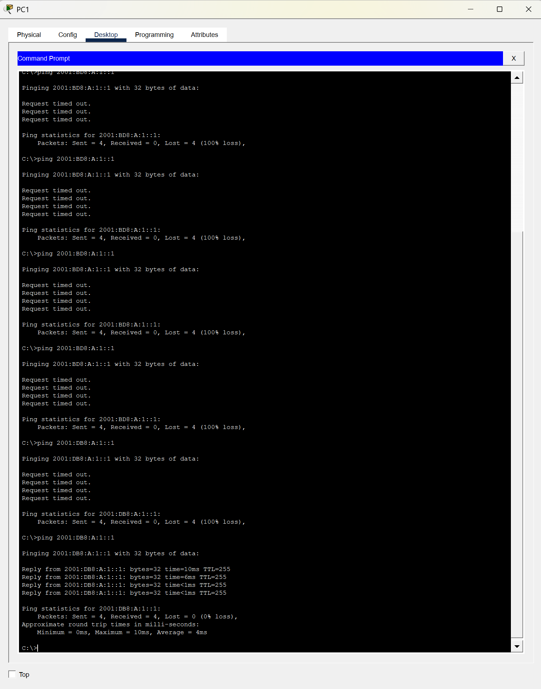
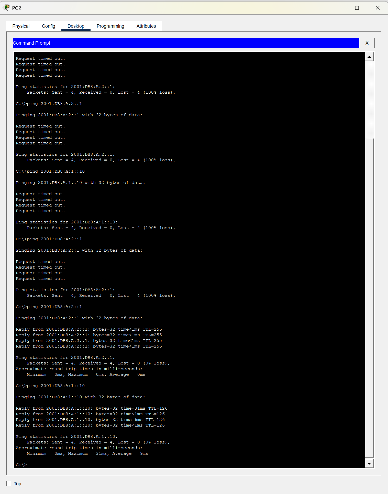
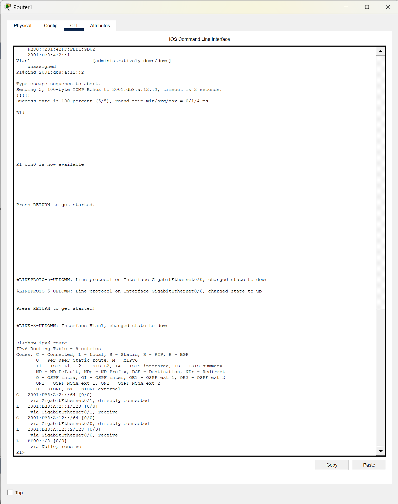
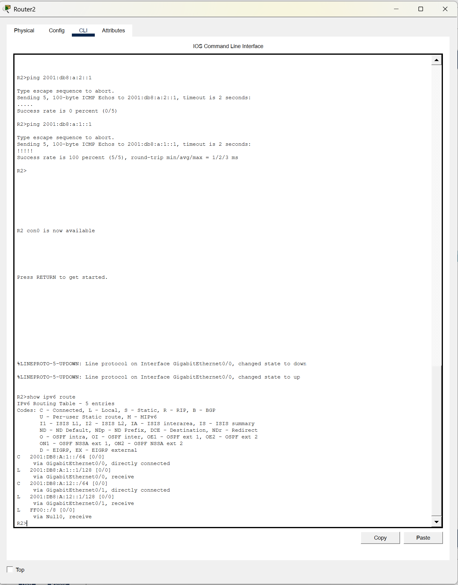

# Lab 04 — IPv6 Basics with Inter-Router Routing (Packet Tracer)

## Objective

In this lab, I configured IPv6 addressing across multiple LANs and implemented inter-router routing using static routes. The goal was to reinforce IPv6 fundamentals and validate end-to-end connectivity across a multi-router topology.

## Topology

- 2 Routers (R1, R2)
- 2 Switches (S1, S2)
- 2 PCs (PC1, PC2)

PC1 connects to R1, PC2 connects to R2, and both routers are connected via a WAN link.

## IPv6 Addressing Scheme

- LAN 1: 2001:DB8:A:1::/64
- LAN 2: 2001:DB8:A:2::/64
- WAN Link: 2001:DB8:A:12::/64

## Technologies Used

- IPv6 Addressing
- Static Routing
- Cisco IOS CLI
- Packet Tracer

## Key Concepts

- Global Unicast Addressing
- Link-Local Addressing
- IPv6 Routing
- Static Routes
- Interface Configuration

## Verification

- PC1 successfully pinged its default gateway
- PC2 successfully pinged its default gateway
- PC1 and PC2 achieved end-to-end connectivity across routers
- Routing tables confirmed proper path selection

## Evidence

### PC1 to Gateway Connectivity

### End-to-End Communication (PC1 to PC2)

### Routing Table (R1)

### Routing Table (R2)

---

## Key Takeaways

- IPv6 routing must be manually enabled using `ipv6 unicast-routing`
- Routers do not forward IPv6 traffic by default
- Each interface must be assigned a unique IPv6 subnet
- Static routes are required for communication between multiple routers
- Interface status must be verified before troubleshooting routing issues
- Addressing errors and overlapping networks can prevent connectivity

## Outcome

This lab successfully demonstrated IPv6 configuration and routing between multiple networks. I also troubleshooted interface issues, addressing conflicts, and routing errors to achieve full connectivity.