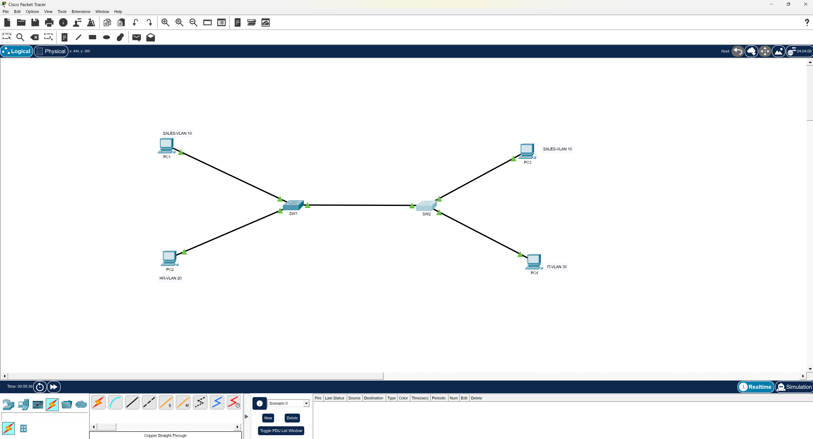

# Lab 01 - VLAN Trunking

## Objective
In this lab, I configured VLAN segmentation across two switches and implemented a trunk link to carry VLAN traffic between them. The goal was to understand how VLANs separate broadcast domains at Layer 2 and how trunking allows the same VLAN to exist across multiple switches.

---

## Technologies Used
- Cisco Packet Tracer
- Cisco IOS CLI
- VLAN configuration
- Trunk configuration
- Basic connectivity testing

---

## Topology
- 2 switches (S1 and S2)
- 4 PCs
- 1 trunk link between the switches
- Access ports assigned to VLANs based on the lab design

The switches were connected using a trunk port so VLAN traffic could pass between them correctly.

---

## VLAN Configuration
| VLAN ID | Name  | Purpose |
|---------|-------|---------|
| 10      | SALES | User segment |
| 20      | HR    | User segment |
| 30      | IT    | User segment |
---

## Key Configurations
- Created VLANs on both switches
- Assigned access ports to the correct VLANs
- Configured the switch-to-switch link as a trunk
- Verified VLAN membership with `show vlan brief`
- Verified trunk status with `show interfaces trunk`

---

## Verification
I verified the lab by checking VLAN membership, confirming the trunk link was active, and testing connectivity behavior between devices.

Expected behavior:
- Devices in the same VLAN across the trunk should communicate successfully
- Devices in different VLANs should not communicate without Layer 3 routing

---

## Troubleshooting
During validation, I worked through a few issues that helped reinforce the purpose of verification commands.

- Confirmed that VLANs existed on both switches
- Verified that the trunk link was carrying VLAN traffic properly
- Corrected device or labeling confusion during testing
- Used CLI verification commands to isolate where communication was failing

Detailed troubleshooting notes are stored in the `troubleshooting` folder.

---

## Files
- `configs/` - switch configuration files
- `evidence/` - screenshots used for proof of work
- `notes/` - commands used, lessons learned, and verification summary
- `topology/` - Packet Tracer file and topology image
- `troubleshooting/` - troubleshooting notes and related lab artifacts
- [Download Packet Tracer File](topology/lab-01-vlan-trunking.pkt)

---

## Key Takeaways
- VLANs separate traffic into different Layer 2 broadcast domains
- Trunk links allow multiple VLANs to travel between switches
- Devices in different VLANs require Layer 3 routing to communicate
- Verification commands are just as important as the configuration itself