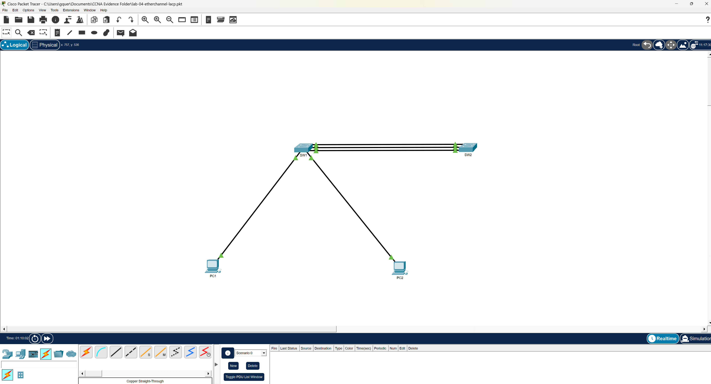

# Lab 04 - EtherChannel (LACP)

## Objective
The objective of this lab is to configure and verify EtherChannel using LACP (Link Aggregation Control Protocol) between two switches. This implementation increases bandwidth, provides redundancy, and improves overall network efficiency by bundling multiple physical links into a single logical interface.

---

## Technologies Used
- Cisco Packet Tracer
- EtherChannel
- LACP (Link Aggregation Control Protocol)
- VLANs
- Trunking
- Spanning Tree Protocol (STP)

---

## Topology
This lab consists of two switches connected using multiple FastEthernet interfaces bundled into a single Port-Channel interface.

- VLAN 10 and VLAN 20 configured on both switches
- Multiple links aggregated using EtherChannel
- Trunking configured on the Port-Channel interface

---

## Configuration Summary

### SW1
- LACP Mode: Active
- Interfaces: Fa0/3 - Fa0/5
- Port-Channel: 1
- Trunk configured on Port-Channel interface

### SW2
- LACP Mode: Passive
- Interfaces: Fa0/3 - Fa0/5
- Port-Channel: 1
- Trunk configured on Port-Channel interface

---

## Key Concepts Demonstrated

EtherChannel combines multiple physical interfaces into a single logical link, which improves bandwidth utilization and provides redundancy. In this lab, LACP was used to dynamically negotiate the channel between switches, ensuring compatibility and reducing configuration errors.

Unlike individual links, the Port-Channel interface is treated as a single link by Spanning Tree Protocol, preventing unnecessary blocking and improving network efficiency.

---

## Verification

The following commands were used to verify proper configuration:

- `show etherchannel summary`
- `show interfaces trunk`
- `show running-config`

Successful verification confirmed:
- Port-Channel is up and operational
- Interfaces are properly bundled
- VLAN traffic is correctly passing across the trunk

---

## Lessons Learned
See: `notes/lessons-learned.md`

---

## Troubleshooting
See: `troubleshooting/troubleshooting.md`

---

## Files

- `configs/` - Switch configurations
- `topology/` - Packet Tracer lab file
- `evidence/` - Verification screenshots
- `notes/` - Lessons learned
- `troubleshooting/` - Troubleshooting steps