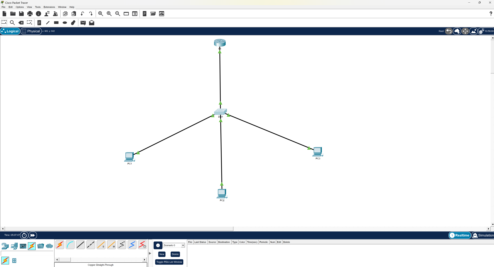

# Lab 03 – Router-on-a-Stick VLAN Design

## Objective
The objective of this lab is to configure inter-VLAN routing using a router-on-a-stick design. This involves segmenting a network into multiple VLANs on a switch and enabling communication between those VLANs through a router using subinterfaces and 802.1Q encapsulation.

---

## Technologies Used
- Cisco Packet Tracer
- VLAN Configuration
- 802.1Q Trunking
- Router Subinterfaces
- Inter-VLAN Routing
- IPv4 Addressing

---

## Topology
This lab consists of one router, one switch, and three end devices. Each PC is assigned to a different VLAN, and the switch is connected to the router using a trunk link.

---

## IP Addressing

| Device | VLAN | IP Address       | Subnet Mask     | Default Gateway |
|--------|------|------------------|------------------|-----------------|
| PC1    | 10   | 192.168.10.10    | 255.255.255.0    | 192.168.10.1    |
| PC2    | 20   | 192.168.20.10    | 255.255.255.0    | 192.168.20.1    |
| PC3    | 30   | 192.168.30.10    | 255.255.255.0    | 192.168.30.1    |

---

## Configuration Summary

### Switch Configuration
- VLANs 10, 20, and 30 were created and named
- Access ports were assigned to each VLAN
- A trunk link was configured between the switch and router
- VLAN traffic was allowed across the trunk using 802.1Q tagging

### Router Configuration
- Subinterfaces were created for each VLAN
- Each subinterface was configured with encapsulation dot1Q
- Each VLAN was assigned a default gateway IP address
- The physical interface was enabled to carry trunk traffic

---

## Verification

The following tests were performed to confirm correct network operation:

Verified VLAN assignments using:
show vlan brief

Verified trunk configuration using:
show interfaces trunk

Verified router interfaces using:
show ip interface brief

Tested connectivity:
PC1 -> PC2 (Successful)
PC1 -> PC3 (Successful)
PC2 -> PC3 (Successful)

All devices were able to communicate across VLANs, confirming that inter-VLAN routing was functioning correctly.

---

## Key Takeaways

This lab demonstrates how VLAN segmentation improves network organization and how routing is required to enable communication between isolated networks. It also highlights the importance of trunk links and encapsulation when transporting multiple VLANs across a single interface.

Additionally, the lab reinforced how ARP plays a role in initial connectivity, as seen when the first ping attempt may fail before successful communication begins.

---

## Files
- configs/router-config.txt
- configs/switch-config.txt
- notes/lessons-learned.md
- troubleshooting/troubleshooting.md