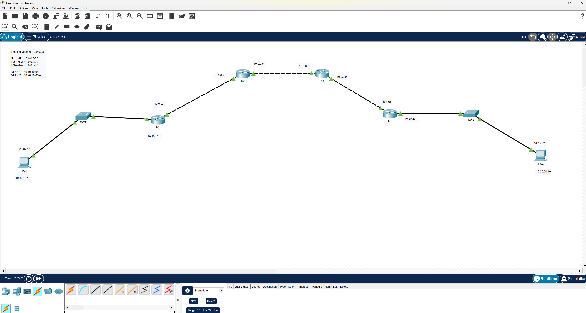

# Lab 05 - OSPF Multi-Area Design

## Objective
In this lab, I designed and implemented a multi-area OSPF topology that integrates VLAN segmentation and router-on-a-stick. The goal was to move beyond single-area routing and begin structuring the network in a way that reflects real-world enterprise design, where scalability, segmentation, and routing efficiency are critical.

---

## What This Lab Demonstrates
This lab demonstrates my ability to:
- Design a multi-area OSPF topology with proper backbone and non-backbone area placement
- Implement VLAN segmentation and inter-VLAN routing using router-on-a-stick
- Configure trunk links to carry multiple VLANs across the network
- Establish full OSPF neighbor adjacencies across multiple routers
- Verify end-to-end connectivity across VLANs and OSPF areas
- Troubleshoot routing and VLAN-related issues during implementation

---

## Technologies Used
- Cisco Packet Tracer
- VLANs
- Trunking (802.1Q)
- Router-on-a-Stick
- OSPF (Multi-Area)
- IPv4 Addressing (/30 point-to-point links)

---

## Topology

---

## IP Addressing

### VLAN Networks
- VLAN 10: 10.10.10.0/24
- VLAN 20: 10.20.20.0/24

### Point-to-Point Links
- R1–R2: 10.0.0.0/30
- R2–R3: 10.0.0.4/30
- R3–R4: 10.0.0.8/30

---

## Configuration Overview

### Switching and VLAN Segmentation
I created VLAN 10 and VLAN 20 to logically separate network traffic. Access ports were assigned to their respective VLANs, and trunk links were configured between switches and routers to allow VLAN traffic to traverse the network. VLAN consistency across switches was critical to ensure proper communication between devices.

### Inter-VLAN Routing
Router-on-a-stick was implemented on the edge routers using subinterfaces with 802.1Q encapsulation. Each VLAN was assigned a default gateway on the router, allowing devices in different VLANs to communicate through Layer 3 routing.

### OSPF Multi-Area Design
OSPF was configured using process ID 1 across all routers. Area 0 was used as the backbone, while Area 1 was introduced to segment the network. R3 was configured as the Area Border Router (ABR), connecting both areas and enabling inter-area routing. This design improves scalability and reflects how enterprise networks are structured.

---

## Verification

## Design Considerations

When designing this topology, I focused on separating Layer 2 and Layer 3 responsibilities. VLANs were used for segmentation at the switch level, while OSPF handled routing between networks. Introducing multiple OSPF areas allowed for better scalability and reduced routing overhead compared to a single-area design.

This approach mirrors real-world enterprise environments where network segmentation, routing efficiency, and structured design are critical for performance and manageability.

### Key Commands Used
show ip interface brief  
show ip route  
show ip ospf neighbor  
show ip protocols  
show vlan brief  
show interfaces trunk  

### Expected Results
- All router interfaces are up/up
- OSPF neighbors reach FULL state
- VLANs are correctly assigned
- Trunks are carrying VLAN 10 and 20
- End devices can communicate across VLANs and areas

---

## Notes

This lab demonstrates how multiple networking concepts can be combined into a single topology. It highlights the importance of structured design, correct OSPF area placement, and proper VLAN and trunk configuration when building a scalable network.

---

## Key Takeaways

This lab reinforced the importance of structured network design. Instead of configuring devices in isolation, I had to think about how VLANs, trunking, and OSPF interact as a complete system. Understanding how OSPF areas connect and how VLAN traffic is routed across the network was critical to achieving full connectivity.

---

## Troubleshooting

See:  
./troubleshooting/troubleshooting.md  

---

## Lessons Learned

See:  
./notes/lessons-learned.md  

---

## Files
- configs/ → Device configurations  
- evidence/ → Screenshots and verification  
- topology/ → Packet Tracer file  