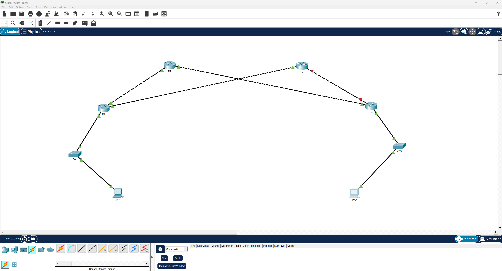

# Lab 05 – Default and Floating Static Routes

## Objective

The goal of this lab is to configure static routing with a primary path and a backup path using floating static routes. The network is designed to maintain connectivity during link failure by automatically switching to an alternate route based on administrative distance.

---

## Technologies Used

- Cisco Packet Tracer
- IPv4 Addressing
- Static Routing
- Floating Static Routes
- Administrative Distance
- CLI Verification Commands

---

## Topology

This lab uses a multi-path routed topology with two possible paths between the source and destination networks.

Primary Path:
R1 → R2 → R4

Backup Path:
R1 → R3 → R4

Both paths are configured so that traffic automatically fails over to the backup route if the primary path becomes unavailable.

---

## IP Addressing

| Device | Interface | IP Address |
|--------|----------|------------|
| R1 | G0/0 | 10.0.12.1/30 |
| R1 | G0/1 | 10.0.13.1/30 |
| R1 | G0/2 | 192.168.10.1/24 |
| R2 | G0/0 | 10.0.12.2/30 |
| R2 | G0/1 | 10.0.24.2/30 |
| R3 | G0/0 | 10.0.13.2/30 |
| R3 | G0/1 | 10.0.34.2/30 |
| R4 | G0/0 | 10.0.34.1/30 |
| R4 | G0/1 | 192.168.40.1/24 |
| R4 | G0/2 | 10.0.24.1/30 |
| PC1 | NIC | 192.168.10.10/24 |
| PC2 | NIC | 192.168.40.10/24 |

---

## Configuration Overview

R1 and R4 were configured with both primary and floating static routes. The primary route uses the default administrative distance of 1, while the backup route uses a higher administrative distance to ensure it is only used during failure conditions.

Example from R1:

ip route 192.168.40.0 255.255.255.0 10.0.12.2  
ip route 192.168.40.0 255.255.255.0 10.0.13.2 10  

Example from R4:

ip route 192.168.10.0 255.255.255.0 10.0.24.2  
ip route 192.168.10.0 255.255.255.0 10.0.34.2 10  

R2 and R3 were configured as transit routers with single-path static routes to avoid competing routing decisions.

---

## Verification

Connectivity was tested between PC1 and PC2 under both normal and failure conditions.

Normal Operation:
Traffic successfully traversed the primary path through R2 with no packet loss.

Failover Test:
The link between R1 and R2 was manually shut down. After a brief convergence period, traffic automatically switched to the backup path through R3. Connectivity was maintained with minimal packet loss during transition.

Routing Table Validation:
The routing table on R1 showed only the primary route during normal operation. After failure, the floating static route appeared in the routing table and was used for forwarding traffic.

---

## Key Concepts Demonstrated

- Static route prioritization using administrative distance  
- Floating static routes for redundancy  
- Failover behavior in routed networks  
- Symmetric vs asymmetric routing  
- Convergence and packet loss during path transitions  

---

## Evidence

Screenshots documenting configuration, failover testing, and verification steps are located in the evidence folder.

---

## Notes

This lab emphasizes the importance of designing routing decisions at the correct points in the network. Instead of configuring redundant routes on every router, control was centralized at the edge devices (R1 and R4), allowing predictable and stable failover behavior.