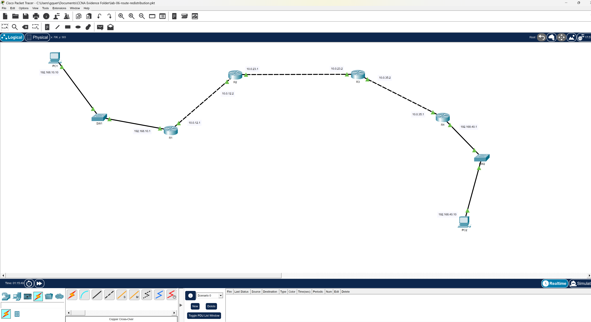

# Lab 06 - Route Redistribution

## Objective

In this lab, I implemented route redistribution between two different routing protocols to allow communication across separate routing domains.

The OSPF domain (R1–R2–R3) and the EIGRP domain (R3–R4) were initially isolated. By configuring redistribution on R3, I enabled bidirectional route exchange, allowing full end-to-end communication between both sides of the network.

This lab demonstrates how a router can function as a boundary between routing protocols and translate routing information between them.

---

## Technologies Used

- Cisco Packet Tracer  
- OSPF (Open Shortest Path First)  
- EIGRP (Enhanced Interior Gateway Routing Protocol)  
- Route Redistribution  
- Loopback Interfaces  
- CLI Verification and Troubleshooting  

---

## Topology Overview

The network consists of two routing domains connected through a redistribution router.

- **OSPF Domain:** R1, R2, R3  
- **EIGRP Domain:** R3, R4  
- **Boundary Router:** R3  
- **Endpoints:** PC1 (OSPF side), PC2 (EIGRP side)

### Traffic Flow

PC1 → R1 → R2 → R3 → R4 → PC2

---

## IP Addressing Plan

| Device | Interface | IP Address | Subnet |
|--------|----------|------------|--------|
| PC1 | NIC | 192.168.10.10 | /24 |
| R1 | G0/0 | 192.168.10.1 | /24 |
| R1 | G0/1 | 10.0.12.1 | /30 |
| R2 | G0/0 | 10.0.12.2 | /30 |
| R2 | G0/1 | 10.0.23.1 | /30 |
| R2 | Lo0 | 192.168.20.1 | /24 |
| R3 | G0/0 | 10.0.23.2 | /30 |
| R3 | G0/1 | 10.0.34.1 | /30 |
| R4 | G0/0 | 10.0.34.2 | /30 |
| R4 | G0/1 | 192.168.40.1 | /24 |
| PC2 | NIC | 192.168.40.10 | /24 |

---

## Routing Design

### OSPF Domain

Configured across:
- R1
- R2
- R3 (left-facing interface)

Advertised networks:
- 192.168.10.0/24  
- 192.168.20.0/24  
- 10.0.12.0/30  
- 10.0.23.0/30  

---

### EIGRP Domain

Configured across:
- R3 (right-facing interface)
- R4

Advertised networks:
- 10.0.34.0/30  
- 192.168.40.0/24  

---

### Redistribution (R3)

R3 acts as the boundary router and performs bidirectional redistribution:

- OSPF routes injected into EIGRP  
- EIGRP routes injected into OSPF  

This allows both routing domains to learn each other’s internal networks.

---

## Verification

### Neighbor Relationships

- `show ip ospf neighbor`  
- `show ip eigrp neighbors`  

---

### Routing Tables

- `show ip route`  
- Verified that:
  - R1 learned 192.168.40.0  
  - R4 learned OSPF-side networks  

---

### End-to-End Connectivity

Before redistribution:
- Traffic failed between PC1 and PC2  

After redistribution:
- Successful ping between PC1 and PC2  
- Full reachability across both routing domains  

---

### Path Verification

Traceroute confirms correct traffic flow:

PC1 → R1 → R2 → R3 → R4 → PC2

---

## Evidence

All validation screenshots are located in the `evidence` folder, including:

- Topology overview  
- OSPF configuration  
- Loopback setup  
- EIGRP configuration  
- Redistribution configuration  
- Routing table verification  
- Failed connectivity (pre-redistribution)  
- Successful connectivity (post-redistribution)  
- Traceroute path  

---

## Troubleshooting Summary

Initial connectivity testing showed that both routing domains were functioning independently, but traffic could not cross between them.

This was expected because route redistribution had not yet been configured. Once redistribution was implemented on R3, both domains successfully exchanged routes and full connectivity was established.

This reinforced the importance of validating each routing domain individually before troubleshooting inter-domain communication.

---

## Key Takeaways

- Route redistribution enables communication between different routing protocols  
- Each router should only advertise its own directly connected networks  
- EIGRP requires a metric during redistribution  
- OSPF requires the `subnets` keyword for proper route injection  
- Loopback interfaces are useful for simulating additional networks  
- End-to-end validation is critical in confirming full network functionality  

---

## What This Lab Demonstrates

This lab demonstrates my ability to:

- Design multi-protocol routing environments  
- Configure OSPF and EIGRP routing domains  
- Implement bidirectional route redistribution  
- Validate routing behavior using CLI tools  
- Troubleshoot connectivity across protocol boundaries  
- Document network builds in a structured, professional format  

---

## Files

- configs/  
- evidence/  
- notes/lessons-learned.md  
- troubleshooting/troubleshooting.md  
- topology/lab-06-route-redistribution.pkt  