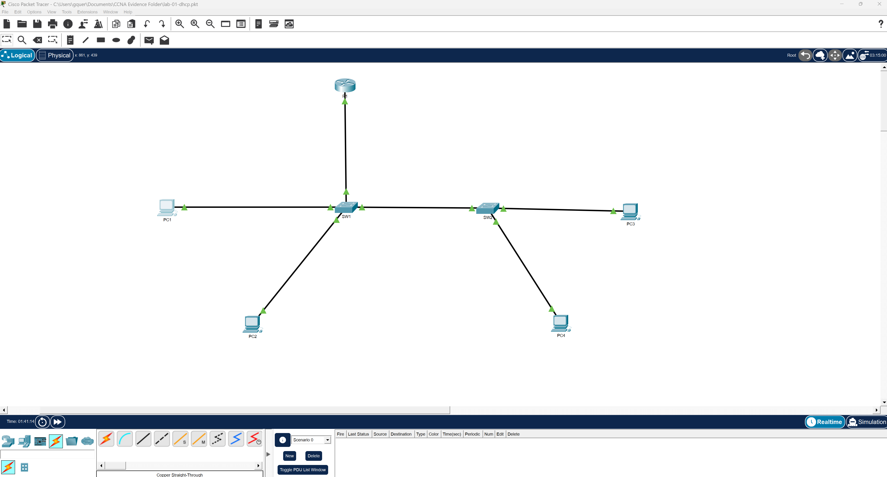

# Lab 01 - DHCP Services & Inter-VLAN Routing

## Overview

This lab focused on implementing DHCP services within a segmented VLAN environment using Router-on-a-Stick inter-VLAN routing. The lab demonstrates how enterprise networks dynamically assign IP addresses across multiple VLANs while maintaining communication between separate broadcast domains.

The environment was designed to simulate a small enterprise network containing:
- Multiple VLANs
- DHCP services
- Inter-VLAN routing
- Trunk links
- Dynamic IP address assignment

---

# Objectives

- Configure VLAN segmentation
- Implement Router-on-a-Stick inter-VLAN routing
- Configure DHCP services on a Cisco router
- Configure trunk ports between switches
- Verify DHCP address assignment
- Verify end-to-end communication between VLANs
- Troubleshoot topology and DHCP-related issues

---

# Technologies Used

- Cisco Packet Tracer
- Cisco IOS CLI
- VLANs
- DHCP
- 802.1Q Trunking
- Router-on-a-Stick
- Inter-VLAN Routing

---

# Topology

## Network Topology

## Devices Used

| Device | Purpose |
|---|---|
| R1 | Router / DHCP Server |
| SW1 | Primary Access Switch |
| SW2 | Secondary Access Switch |
| PC1-PC4 | End Devices |

---

# VLAN Information

| VLAN | Name | Network | Gateway |
|---|---|---|---|
| 10 | Sales | 192.168.10.0/24 | 192.168.10.1 |
| 20 | HR | 192.168.20.0/24 | 192.168.20.1 |

---

# Network Design

The topology uses a Router-on-a-Stick architecture where:
- R1 connects to SW1 using a trunk link
- SW1 connects to SW2 using a trunk link
- VLAN traffic traverses between switches through 802.1Q tagging
- Router subinterfaces provide Layer 3 routing between VLANs

---

# Router Configuration Summary

R1 was configured with:
- Subinterfaces:
  - G0/1.10
  - G0/1.20
- 802.1Q encapsulation
- DHCP pools for VLAN 10 and VLAN 20
- Excluded address ranges
- Default gateway assignments

---

# Switch Configuration Summary

## SW1
- Configured VLAN 10 and VLAN 20
- Configured access ports
- Configured trunk link to:
  - R1
  - SW2

## SW2
- Configured VLAN 10 and VLAN 20
- Configured access ports
- Configured trunk link to SW1

---

# DHCP Configuration

## DHCP Pools Configured

### VLAN10
- Network: 192.168.10.0/24
- Default Gateway: 192.168.10.1
- DNS Server: 8.8.8.8

### VLAN20
- Network: 192.168.20.0/24
- Default Gateway: 192.168.20.1
- DNS Server: 8.8.8.8

---

# Verification Performed

The following validations were completed successfully:

- DHCP address assignment
- VLAN trunk verification
- Inter-VLAN communication
- Gateway reachability
- DHCP bindings verification
- End-to-end ping testing

---

# Problems Encountered

## APIPA Addressing
Several PCs initially received:
- 169.254.x.x addresses

This issue occurred because the original topology design conflicted with Router-on-a-Stick architecture and prevented DHCP traffic from properly reaching the router.

## Overlapping Subnet Error
An overlapping subnet error occurred when attempting to configure multiple interfaces within the same subnet space.

This issue was resolved by redesigning the topology correctly using:
- one physical trunk interface
- multiple logical router subinterfaces

---

# Lessons Learned

This lab reinforced several critical networking concepts:
- Router-on-a-Stick implementation
- VLAN segmentation
- DHCP troubleshooting
- 802.1Q trunking
- Inter-VLAN routing
- Enterprise topology design

One of the biggest lessons learned was understanding how Router-on-a-Stick relies on:
- a single physical router interface
- VLAN-tagged subinterfaces
- properly configured trunk links

This lab also demonstrated how incorrect Layer 2 and Layer 3 topology design can directly impact DHCP functionality.

---

# Evidence

## Step 01 - Topology
- DHCP topology design

## Step 02 - Router Configuration
- DHCP bindings
- Running configuration
- Interface verification
- DHCP configuration

## Step 03 - Switch Configuration
- Trunk verification
- VLAN verification

## Step 04 - DHCP Verification
- DHCP-assigned IP addresses for all PCs

## Step 05 - Connectivity Testing
- Successful inter-VLAN communication

## Step 06 - Troubleshooting
- Troubleshooting documentation
- Design corrections
- DHCP issue resolution

---

# Files Included

## Configurations
- r1-config.txt
- sw1-config.txt
- sw2-config.txt

## Documentation
- README.md
- lab-notes.md
- troubleshooting.md

## Evidence
- Topology screenshots
- DHCP verification screenshots
- Trunk verification screenshots
- Connectivity testing screenshots

---

# Final Result

The final environment successfully demonstrated:
- VLAN segmentation
- Dynamic DHCP assignment
- Router-on-a-Stick inter-VLAN routing
- Successful communication between VLANs
- Proper trunk propagation across multiple switches